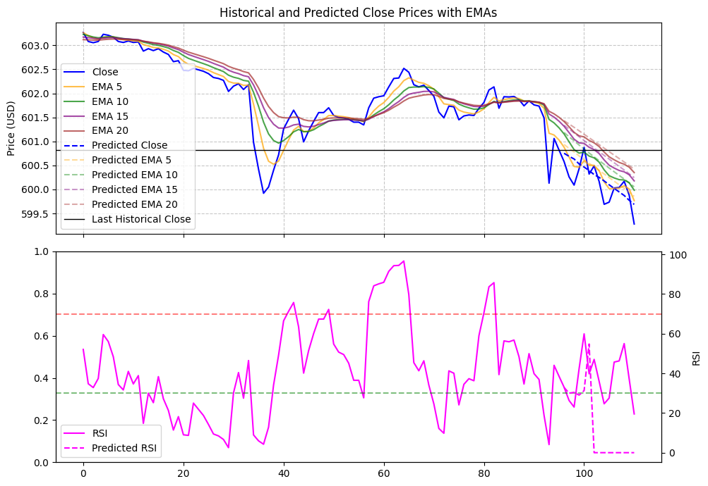
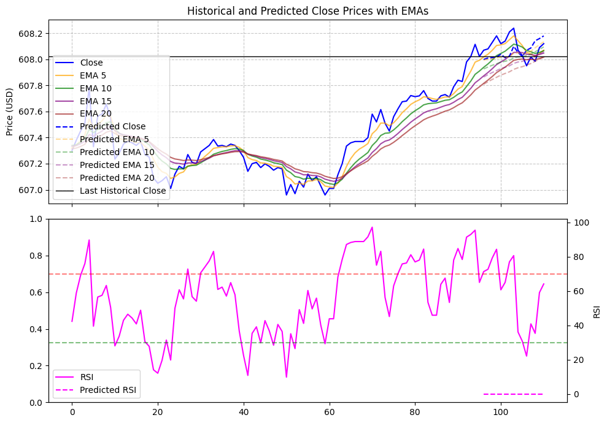
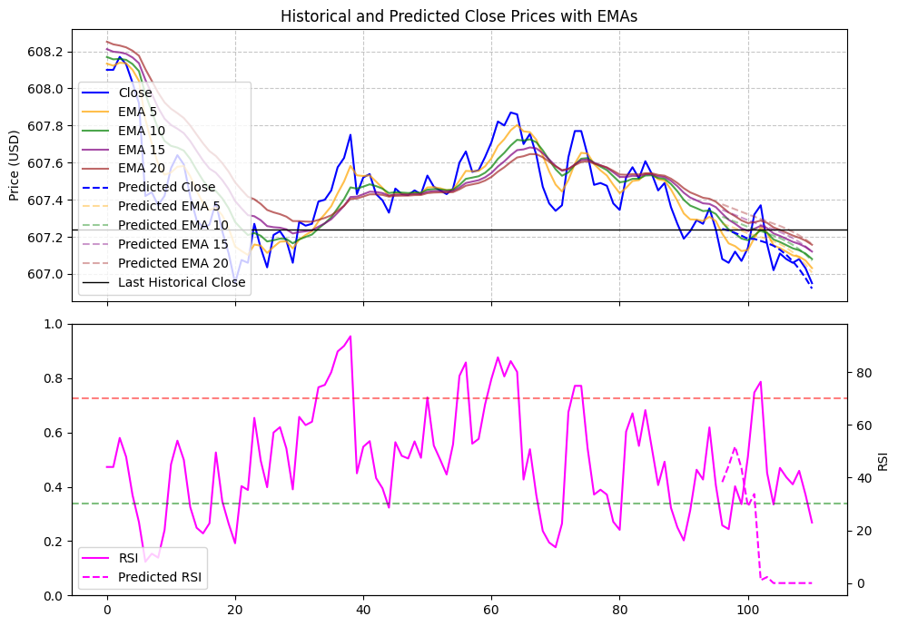

# Futures.AI

This is a follow-up project to Market.AI https://github.com/cyruslauwork/market.ai

Experimental screenshots during development:

- ANN
  
  
- GRU
  
  

### Source code is provided for reference only.

### Setup

Download Miniconda3-latest-MacOSX-arm64.sh
bash'''
bash Miniconda3-latest-Linux-x86_64.sh
'''
After installation, you may need to restart your terminal or run source ~/.bashrc to activate the conda command.
bash'''
conda update conda
conda create -n myenv python=3.11
conda activate myenv
pip install pandas numpy requests matplotlib
pip install -U scikit-learn
pip install torch torchvision torchaudio
'''
Exit conda env: conda deactivate
